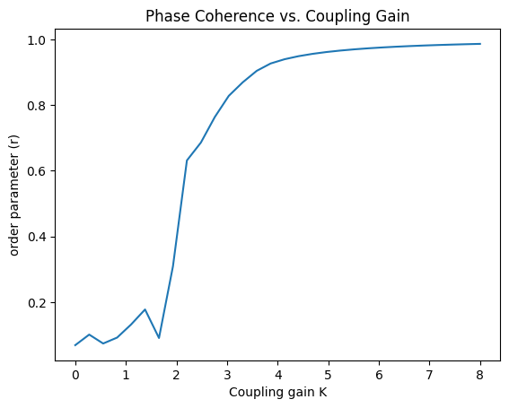

# Oscillations

Periodicity is ubiquitous in nature. Mechanical, Natural, Planetary motions etc. In mathematics we come across a lot of eqautions that are periodic in nature like sine and cosine  waves, exponentials.

Now we are interested in weakly coupled oscillators. In nature, a fascinating phenomenon occurs where in fireflies sychronize their flashes rythmically by nudging their neighbours when they recieve signals from their neighbours. To be very general, we can think about runners on the track synchonising their speed. The population of neurons in the brain may synchronise in an effort to produce strong signal, or metronomes on a moving plane. In biology networks of pacemaker cells in the heart, circadian pacemaker cells in the brain, metabolic synchrony in yeast cell suspensions, crickets that chirp in unison. Examples in physics include Josephson junctions, arrays of lasers, power grid

# Kuramoto Model

The Kuramoto model is a mathematical model used in describing synchronisation. THat is, when a network of oscillators lock on to a common frequency despite differences in frequency of the individual oscillators. It was inspired by behaviour of many chemical and biological oscillators, and it has found widespread applications in areas such as neuroscience.

Weiner first studied collective synchronisation. He said that it is also involved in the generation of alpha rythms in the brain. Winfree gave a fruitful approach using it to study licing organisms, and then it was extended by Kuramoto which is what we study called the Kuramoto model.

## The model

The Kuramoto model consists of a population of N oscillators whose dynamics are goverened by $$\dot \theta_i=\omega_i+\frac{K}{N}\sum_{j=1}^N sin(\theta_j-\theta_i), \;\;\; i=1,2,...,N$$

Here $\theta_i \in S^1$ is the phase of the i-th oscillator, $\omega_i \in R$ is its natural frequency and $K>0$ is the coupling gain.

### The frequency distribution

THe natural frequencies are distributed with probability density $g(\omega)$, and it is assumeed to be unimodal (a probability distribution with a single peak, or mode, where one value is more frequently observed than any other) and symmetric about the mean frequency $\Omega$ i.e., $g(\Omega + \omega)=g(\Omega - \omega)$.

We want a system of phase oscillators who have the mean of natural frequencies as zero. This is achieved by taking a rotating frame, by the transformation $\theta_i \to \theta_i + \Omega t$, where $\Omega$ is the first moment of $g(\omega)$. So, we get $g(\omega)=g(-\omega) \forall \omega$.

The oscillators synchronize if $$\dot \theta_i-\dot\theta_j \to 0 \;\;\; as \;\;\; t\to \infty \;\;\; \forall\; i,j =1,...,N$$ or the phase difference given by $\theta_i-\theta_j$ becomes constant asymptotically.

### Order parameter

It is the measure of phase coherence of the oscillator population. It is defined as $$re^{i\psi}=\frac{1}{N}\sum_{j=1}^N e^{i\theta_j}$$ and $0\leq r(t) \leq 1$. It converges to a contant value 1 if the oscillators synchronize $r_\infty \leq 1$ but if the oscillators add incoherently then $r\to 0$.

We can write the ODE suing the order parameter and we get, $$\dot \theta_i = \omega_i + \frac{K}{N} rsin(\theta_i - \psi), \;\;\; i=1,...,N.$$

As $N\to \infty$, there is a critical value $(K_C)$ of the coupling gain K such that there for all $K<K_C$, te oscillators are incoherent and do not synchronize, but for $K>K_C$ they become unstable and synchronize.

With time, we can see that the order parameter goes to 1 and we csn also see that for ten different K values can be seen in the image below. The order parameter vs K is also plotted next.

    

    

After the oscillations synchronise they eventually settle at some $r_\infty(K)<1$. Kuramoto got solutions for $K_C$. For $K>K_C$, the population of oscillators divides into two groups. One where the oscillators whose natural frequency is close to the mean frequency $\Omega$ and one where the natural freqency is quite far from the mean frequency. For the former case, they all lock on to the mean frequency and start rotating. For the latter case, they all fall out of sync more and drift away relative to the synchronised cluster oscillators.

    
    
<em>Phase on a complex plain</em>

The phases are plotted like shown below. the centroid of all the points is given by $r e^{i\psi}$.

    
    
<em>Phase plot on the complex plane</em>

The two cases above will be when $r\to 1$ and the oscillators will be in a clump and when the oscillators are scattered when $r \to 0$ and the individual.

The plots will look like this ideally

    
    
<em>Phase coherence (r) vs the coupling gain (K)</em>

## Kuramotos analysis

With further increase in K we see that more of the oscillators tend to get into the synchronised cluster.

When we go to the rotating frame with frequency $\Omega$, we can choose $\Psi \equiv 0$ giving us $$\dot \theta_i = \omega_i - Krsin\theta_i, \;\;\; i=1,...,N$$. All oscillators are independent in the steady solutions. We solve for the motions of the oscillator which depends on r and these inturn give us the r and $\psi$ which will be consistent with the original values assumed. Which is the self-consistency condition.

The solutions exhibit two types of long term behaviour, depending on the size of $|\omega_i|$ relative to Kr and they approach a stable fixed point defined implicitly by $\omega_i = Krsin\theta_i$ which are phase locked at frequency $\Omega$ in the original frame.

Oscillators with $|\omega_i|>Kr$ are drifting and are non-uniform. This is how we see the splitting of the two types of oscillators. One is locked that has a frequency at the center of $g(\omega)$ and the drifting corresponds to the tail of $g(\omega)$.

The given code shows the model, we can change the values of different parameters and see the plots for the same.